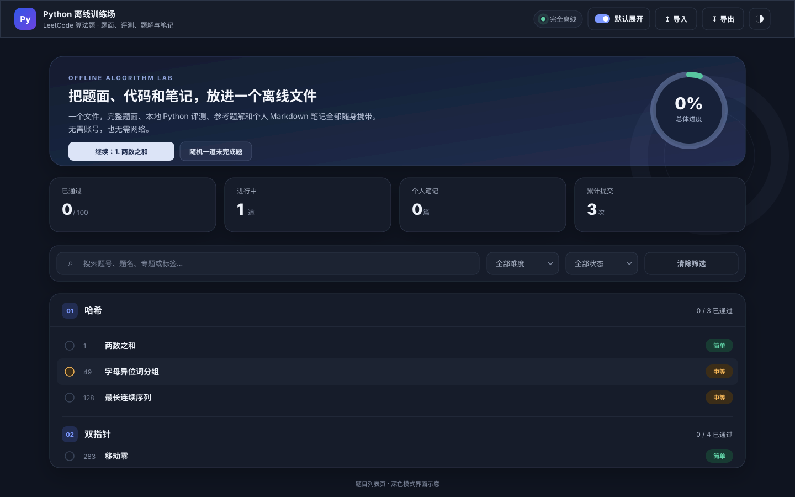
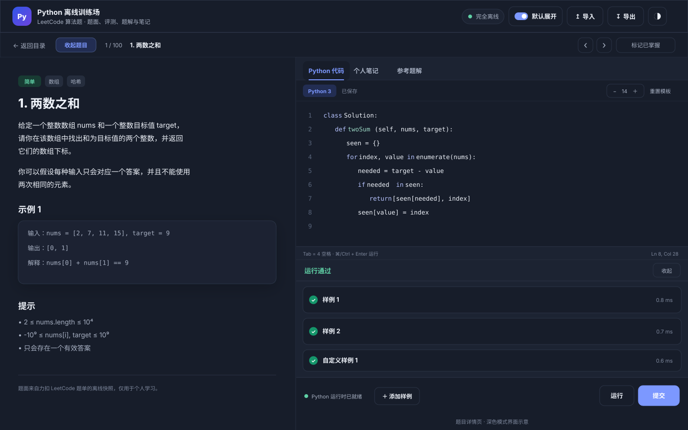
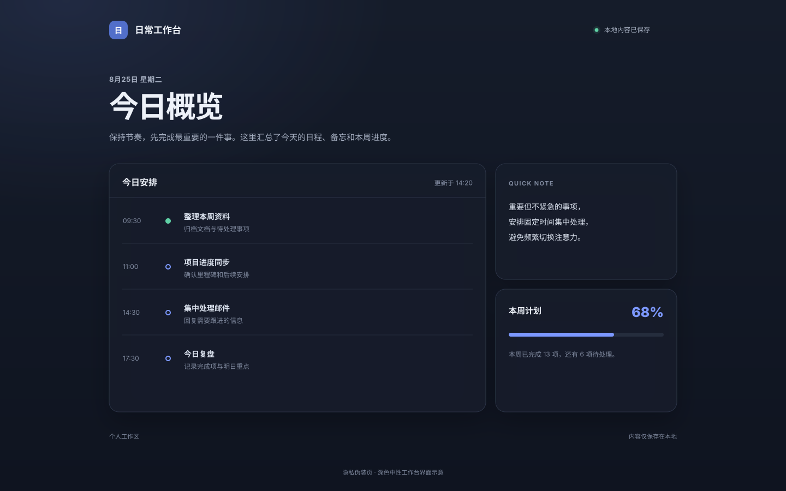

# LC Python 离线训练场

一个开箱即用的单 HTML Python 离线刷题工具。

## 界面预览

<table>
  <tr>
    <th width="33.33%">题目列表页</th>
    <th width="33.33%">题目详情页</th>
    <th width="33.33%">隐私伪装页</th>
  </tr>
  <tr>
    <td align="center">
      <a href="./docs/images/problem-list.svg"></a>
    </td>
    <td align="center">
      <a href="./docs/images/problem-detail.svg"></a>
    </td>
    <td align="center">
      <a href="./docs/images/privacy-view.svg"></a>
    </td>
  </tr>
</table>

点击缩略图可查看完整示意图。

## 使用

下载后直接双击打开：

- [`lc_offline_compact.html`](./lc_offline_compact.html)：压缩版，体积更小，推荐使用。
- [`lc_offline.html`](./lc_offline.html)：标准版，适合不支持 `DecompressionStream` 的浏览器。

两个版本都内嵌题目、图片、题解、评测器和 Python 运行时，不依赖其他文件，也不会联网加载资源。Python 评测在独立 Web Worker 中运行，请使用最新版 Chrome、Edge、Safari 或 Firefox；建议定期导出 Markdown 备份。

## 功能

- 17 个专题、100 道 LC 中文题目，包含题面、示意图和参考题解
- 完整离线的 Python 运行时、本地评测及自定义样例
- 代码区可切换核心模式与 ACM 标准输入输出模式，两套代码分别自动保存并共用运行、提交和自定义样例；参考题解会同步切换为逐题生成的精简 ACM 完整程序
- ACM 模式按题目生成纯文本输入说明与示例，数组带长度、矩阵带行列数、设计题逐行输入操作
- Python 语法高亮、缩进辅助、括号补全和 Black 格式化
- 适配桌面与移动端的题面、代码和笔记工作区
- 自动保存代码、笔记与进度，支持 Markdown 导入导出
- 支持搜索筛选、随机选题、重置进度和明暗主题
- 快速连按两次 `Enter` 切换隐私伪装页

## 隐私伪装页

在页面任意位置快速连按两次 `Enter`，即可切换到与刷题无关的随机工作台，同时隐藏页面内容、浏览器标题和地址栏中的题目标识。再次连按两次即可恢复原工作区。

> 隐私伪装页用于临时遮挡屏幕内容，不提供密码保护、加密或访问控制。如果需要真正隔离学习记录，请关闭页面或清理浏览器为该文件保存的本地数据。

本地评估仅用于日常练习，不等同于力扣官方测试。题面版权归 LC 及原作者；Python 运行时使用 Pyodide（MPL-2.0）与 CPython，代码格式化使用 Black（MIT）。

## 开发校验

```bash
node scripts/project.mjs build
node scripts/project.mjs test
```

`build` 生成标准版和压缩版，`test` 执行完整构建与功能校验。项目没有第三方 npm 依赖。

前端结构、样式与交互集中在 `src/app.html`；题目快照、题解和 Python 评测器保持独立，便于分别维护。
