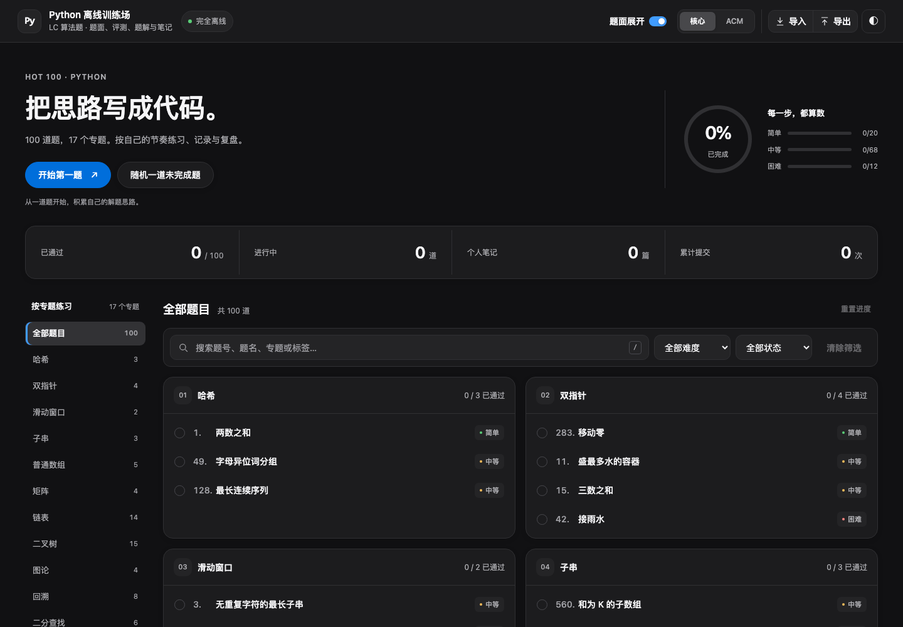
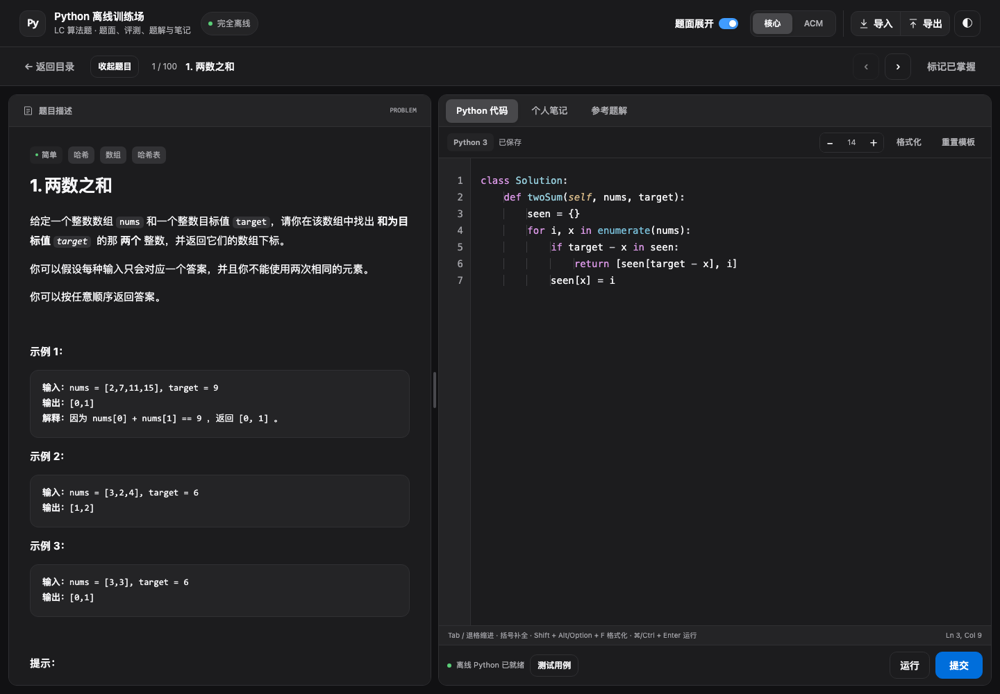
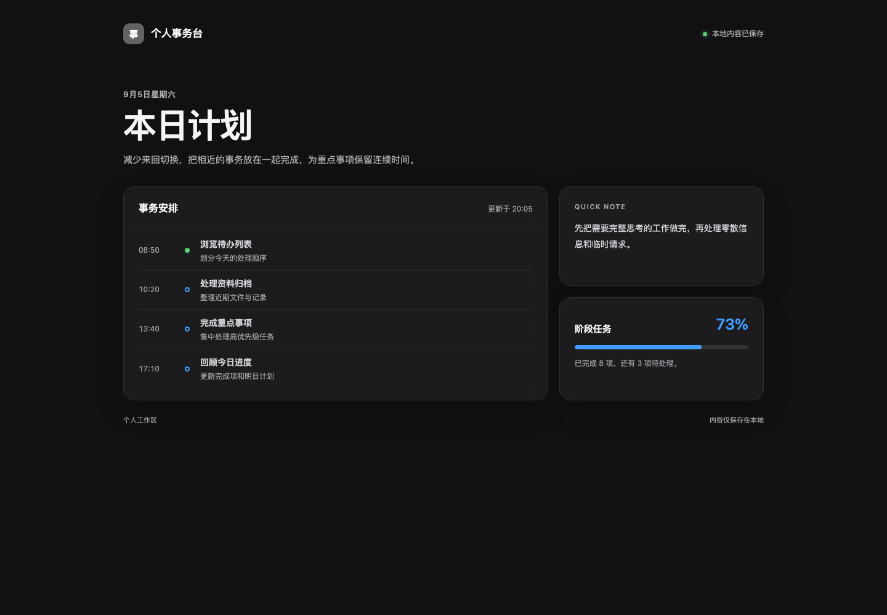

# LC Python 离线训练场

一个开箱即用的单 HTML Python 离线刷题工具。

## 界面预览

<table>
  <tr>
    <th width="33.33%">题目列表页</th>
    <th width="33.33%">题目详情页</th>
    <th width="33.33%">隐私伪装页</th>
  </tr>
  <tr>
    <td align="center">
      <a href="./docs/images/catalog-desktop.png"></a>
    </td>
    <td align="center">
      <a href="./docs/images/workspace-desktop.png"></a>
    </td>
    <td align="center">
      <a href="./docs/images/privacy-desktop.png"></a>
    </td>
  </tr>
</table>

点击缩略图可查看完整截图；另有[浅色主题](./docs/images/catalog-light.png)和[手机端目录](./docs/images/catalog-mobile.png)。

界面参考 [Apple HIG](https://developer.apple.com/design/human-interface-guidelines/) 的文字层级与颜色使用建议：黑白灰内容、蓝色主要操作、轻透工具栏与分段控件，支持明暗主题、增强对比度和减少透明效果。

## 使用

下载后直接双击打开：

- [`lc_offline_compact.html`](./lc_offline_compact.html)：压缩版，体积更小，推荐使用。
- [`lc_offline.html`](./lc_offline.html)：未压缩版，便于直接查看生成后的源码。

两个版本都内嵌题目、图片、题解、评测器和 Python 运行时，不依赖其他文件，也不会联网加载资源。仅面向现代浏览器，Python 资源解码和评测在独立模块 Web Worker 中运行；请使用最新版 Chrome、Edge、Safari 或 Firefox，建议定期导出 JSON 备份。资源编解码直接使用原生 `Uint8Array.fromBase64()` / `toBase64()`，不提供旧浏览器兼容层；这些 API 自 2025 年 9 月起已进入现代浏览器基线（[MDN](https://developer.mozilla.org/en-US/docs/Web/JavaScript/Reference/Global_Objects/Uint8Array/fromBase64)）。

## 功能

- 17 个专题、100 道 LC 中文题目，包含题面、示意图和参考题解
- 完整离线的 Python 运行时、本地评测及自定义样例
- 代码区可切换核心模式与 ACM 标准输入输出模式，两套代码分别自动保存并共用运行、提交和自定义样例；参考题解会同步切换为逐题生成的精简 ACM 完整程序
- ACM 模式按题目生成纯文本输入说明与示例，数组带长度、矩阵带行列数、设计题逐行输入操作
- Python 语法高亮、缩进辅助、括号补全和 Black 格式化
- 专题导航与难度、状态、搜索组合筛选；桌面双列题目卡片，移动端横向专题导航
- 搜索支持空格分隔的多个关键词、全角输入及匹配文字高亮；按 `/` 或 `⌘/Ctrl + K` 聚焦搜索
- 总体与分难度完成进度、上次练习定位；返回目录恢复滚动位置与键盘焦点
- 适配桌面与移动端的题面、代码和笔记工作区，编辑器行号随代码同步滚动
- 弹窗固定标题和操作区，内容独立滚动；手机端导入预览以卡片展示
- 自动保存代码、笔记与进度，支持完整 JSON 备份恢复和 Markdown 阅读导出
- 保存提示反映实际写入结果；配额不足仍读取已有记录，损坏的本地数据暂停覆盖
- 支持搜索筛选、随机选题、重置进度和明暗主题
- 快速连按两次 `Enter` 切换隐私伪装页

## 隐私伪装页

在页面快速连按两次 `Enter`，即可切换到与刷题无关的随机工作台，同时隐藏页面内容、浏览器标题和地址栏中的题目标识。再次连按两次即可恢复原工作区。弹窗和目录筛选控件内的 `Enter` 保留用于当前操作，不触发隐私切换。

> 隐私伪装页用于临时遮挡屏幕内容，不提供密码保护、加密或访问控制。如果需要真正隔离学习记录，请关闭页面或清理浏览器为该文件保存的本地数据。

本地评估仅用于日常练习，不等同于力扣官方测试。题面版权归 LC 及原作者；Python 运行时使用 Pyodide（MPL-2.0）与 CPython，代码格式化使用 Black（MIT）。

## 备份与导出

点击「导出」，默认生成完整 JSON 备份，包含核心与 ACM 两套代码、两套自定义样例、笔记、学习进度、时间和全部偏好设置。文件只包含已保存的题目记录，可导入到空白环境中恢复。

「导入」仅接受当前 JSON 备份格式，最大 50 MiB。确认前可预览新增、冲突、相同和无效记录及其原因；默认保留本地冲突记录，也可选择用备份完整替换，并选择是否恢复偏好设置。备份中没有的题目保持原样。重复题目标识或不支持的格式会拒绝整个文件；部分记录损坏时可预览并跳过这些记录。

导入先保存再更新页面；存储失败时保留现有数据，可重试或明确选择「仅本次会话导入」。会话导入会暂停自动保存，刷新前应导出 JSON 备份。成功导入后，页头出现「↶」按钮，可撤销最近一次导入；撤销记录只保留在本次会话中，并会一并撤回受影响题目在导入后的修改。

Markdown 用于阅读与分享，可选择同时显示核心与 ACM 代码，不用于恢复学习记录；导入仅接受完整 JSON 备份。

## 开发校验

```bash
node scripts/project.mjs build
node scripts/project.mjs test
node scripts/browser-smoke.mjs
```

`build` 生成标准版和压缩版，`test` 执行完整构建与功能校验。需要本机 Node.js、Python 3、`.cache/runtime/` 中的 Pyodide 资源及 `src/vendor/` 中的格式化器依赖；构建过程不下载资源，缺失时会报告对应文件。

`browser-smoke.mjs` 使用本机 Chrome/Chromium 验证两个 HTML 在 `file://` 下的评测、格式化、备份恢复、交互回归和 7 种视口布局，可通过 `CHROME_PATH` 指定浏览器。测试使用临时浏览器配置，不接触日常浏览器的学习记录。添加 `--splitter-only` 可单独验证分栏拖动：覆盖 901 / 1024 / 1440 / 2048px 宽度、鼠标与触摸、指针捕获丢失、窗口失焦、页面切换、键盘调整及刷新恢复。添加 `--layout-after` 只执行截图流程，生成 14 张目录、工作区及弹窗截图，保存到 `/private/tmp/lc-layout-review/after/`；完整功能测试请运行不带参数的命令。项目没有第三方 npm 依赖。

添加 `--filters-only` 可单独验证筛选菜单的明暗主题、鼠标与触摸、键盘选择、关闭与焦点恢复，以及 320 / 390px 窄屏布局；截图保存在 `/private/tmp/lc-filter-review/`。

添加 `--components-only` 可验证格式化状态栏反馈、模板恢复确认、导出格式卡片和 ACM 折叠说明；11 张深浅主题及移动端截图保存在 `/private/tmp/lc-components-review/`。

## 源码结构

| 文件 | 职责 |
| --- | --- |
| `src/app.html` | 页面结构与可访问语义 |
| `src/styles.css` | 明暗主题、组件样式、响应式与打印布局 |
| `src/ui/app.js` | 常量、数据索引、状态加载和持久化 |
| `src/ui/catalog.js` | 搜索、专题导航、学习统计和目录渲染 |
| `src/ui/filters.js` | 随主题切换的筛选菜单、键盘选择与焦点管理 |
| `src/ui/workspace.js`、`editor.js` | 题目切换、分栏、代码模式、高亮和编辑操作 |
| `src/ui/acm.js` | ACM 输入解析、样例转换和参考程序生成 |
| `src/ui/judge.js` | Python Worker 生命周期、评测、格式化和结果控制台 |
| `src/ui/dialogs.js`、`backup-ui.js`、`privacy.js` | 样例弹窗、备份交互与隐私页 |
| `src/ui/events.js` | 事件绑定与应用启动 |
| `src/backup.mjs` | 独立的备份格式校验与合并规则 |
| `scripts/project.mjs` | 本地构建和功能校验 |

前端脚本按构建器中的 `UI_SOURCES` 顺序合并，在一个脚本作用域中执行；浏览器端无需模块加载器或网络请求。请编辑 `src/` 后重新构建，根目录的两个 HTML 是生成产物。题目快照、题解和 Python 评测器保持独立。

搜索会复用专题导航节点，相同结果不重建列表；代码高亮按动画帧合并刷新，超过 200,000 字符时临时使用纯文本显示，回到阈值以内自动恢复高亮。默认 350 ms 合并自动保存，切换到后台或关闭页面时立即写入。
